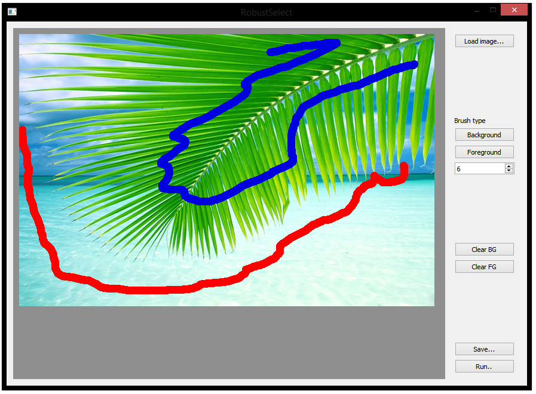

Accurate Binary Image Selection from Inaccurate User Input
============================

Windows binaries for the paper "Accurate Binary Image Selection from Inaccurate User Input" with a GUI.

You need to install 'vcredist_x86.exe' before you can run the compiled RobustSelect.exe.

Original source code and paper at: http://www0.cs.ucl.ac.uk/staff/K.Subr/research.html

All credit goes to original others. This is simply a port to Windows with a basic GUI.

